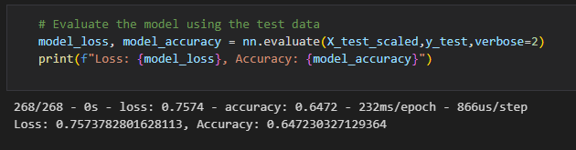
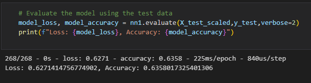
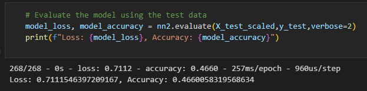
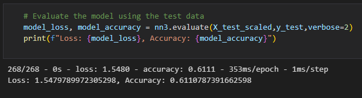

# Neural_Network_Charity_Analysis
## Project Overview
Alphabet Soup Charity is trying to identify which recipients are most successful in order to ensure that our money is being used effectively. We are working on a deep learning model that is expected to be able to predict with around 75% accuracy which recipients are likely to be successful.

## Results
#### Data Preprocessing - 
  - The variable that was considered as the target for our model was the IS_SUCCESSFUL column. 
  - The features of the model are AFFILIATION,APPLICATION_TYPE, ASK_AMT, CLASSIFICATION, INCOME_AMT, ORGANIZATION, SPECIAL_CONSIDERATIONS, STATUS and USE_CASE
  - The "NAME" and "EIN" variables do not affect the success or the failure rate and hence are dropped out of the table.

#### Compiling, Training, and Evaluating the Model - 
  - In the original model, 2 hidden layers were used with 80 neurons in first layer and 30 neurons in 2nd layer. The activation layer was relu. 
  
  - For the first optimization, a third layer was added with 30 neurons. The accuracy loss was 0.6271 and the Accuracy was 0.6358.
  
  - For the second optimization, three layers were used and 100, 50 and 50 neurons were used in respective order. The loss was 0.7112 and the accuracy was 0.4660. The activation layer was changed to sigmoid.
  
  - For the third one, a 4th layer was added and the activation layer was changed to relu. Neurons were 250, 100, 75 and 120 in their respective layers. The loss was 1.5480 and the accuracy was 0.6111.
  
  - Inspite of changing the layers and adding and removing various neurons, the target model performance could not be achieved.
  - We tried to add additional layers and increase and decrease the number of neurons so that the target model performance could be achieved. However this attempt was not successful.

## Summary
Our deep learning model was unsuccessful in achieving the target performance. We tried changing the neurons used in the model as well as adding additional layers, but we were not able to achieve the desired results. We also tried switching relu with sigmoid and vice versa.

After making three different changes to the model, it was found that a more accurate target performance model could be achieved by changing the activation layer model as well as the neurons used in the model. Other than this, a Random Forest Classifier could also be used as an alternate model since it has the ability to perform binary classification and handle large data sets.
